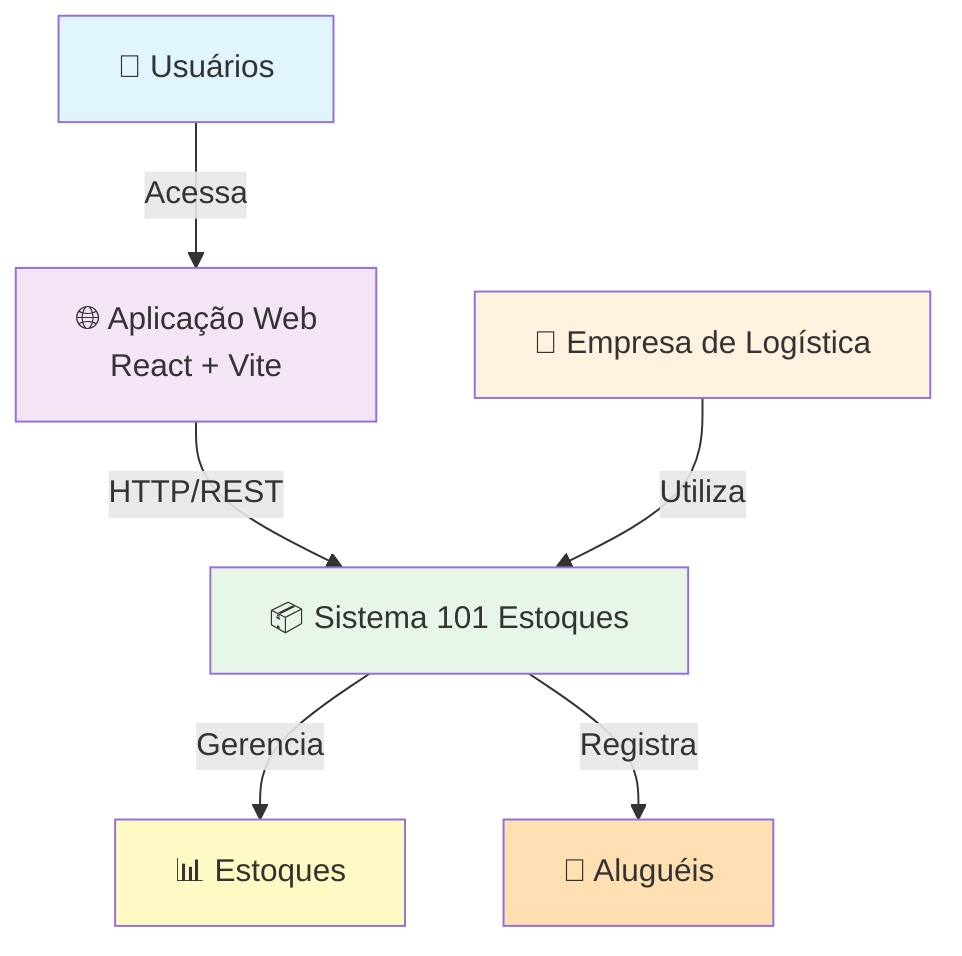

## C4 Model - Nível 1: Context

**Escopo**: Sistema 101 Estoques em seu contexto empresarial

### Atores Principais
1. **Usuário Final**: Consultor de logística ou gerente de estoque
2. **Empresa de Logística**: Cliente que utiliza o sistema
3. **Sistema 101 Estoques**: Aplicação central

### Relacionamentos
- Usuários acessam a aplicação web para gerenciar estoques e aluguéis
- Sistema fornece informações consolidadas sobre inventário e operações
- Empresa utiliza dados para tomar decisões operacionais

### Sistemas Externos
- (Futuros) Integração com SAP/ERP
- (Futuros) API de notificações (email/SMS)
- (Futuros) Análise de dados (BI)
