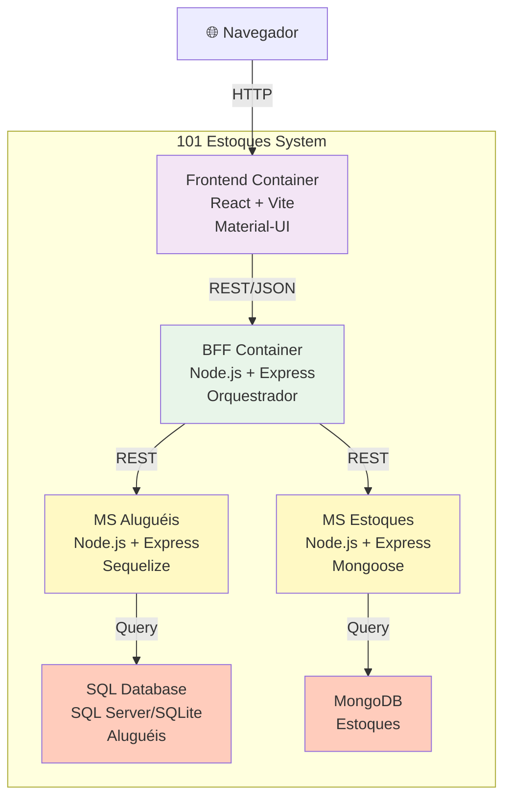

## C4 Model - Nível 2: Container

**Escopo**: Arquitetura dos principais containers que compõem o sistema

### Containers Principais

#### 1. **Frontend Container**
- **Tecnologia**: React 18, Vite, Material-UI
- **Responsabilidade**: Interface visual, navegação, validação de entrada
- **Comunicação**: HTTP/REST com BFF
- **Deployment**: Firebase Hosting

#### 2. **BFF Container** (Backend For Frontend)
- **Tecnologia**: Node.js, Express
- **Responsabilidade**: Orquestração, agregação de dados, roteamento
- **Comunicação**: 
  - Recebe requisições do Frontend
  - Roteia para microserviços
- **Deployment**: Firebase Cloud Functions

#### 3. **Microserviço Aluguéis**
- **Tecnologia**: Node.js, Express, Sequelize ORM
- **Responsabilidade**: CRUD de aluguéis, validação de negócio
- **Persistência**: SQL Server (produção) / SQLite (dev)
- **Deployment**: Firebase Cloud Functions

#### 4. **Microserviço Estoques**
- **Tecnologia**: Node.js, Express, Mongoose
- **Responsabilidade**: CRUD de estoques, gerenciamento de inventário
- **Persistência**: MongoDB Atlas (produção) / Local (dev)
- **Deployment**: Firebase Cloud Functions

#### 5. **SQL Database**
- **Tipo**: Relacional (SQL Server / SQLite)
- **Dados**: Aluguéis, clientes, datas, valores
- **Acesso**: Apenas MS Aluguéis

#### 6. **MongoDB**
- **Tipo**: Documento (NoSQL)
- **Dados**: Estoques, produtos, quantidades, localizações
- **Acesso**: Apenas MS Estoques

### Fluxos de Dados
1. Usuário acessa Frontend → Vite carrega SPA
2. Frontend envia requisição → BFF recebe
3. BFF roteia → MS Aluguéis OU MS Estoques
4. Microserviço consulta → Banco específico
5. Resposta volta → Frontend atualiza tela
