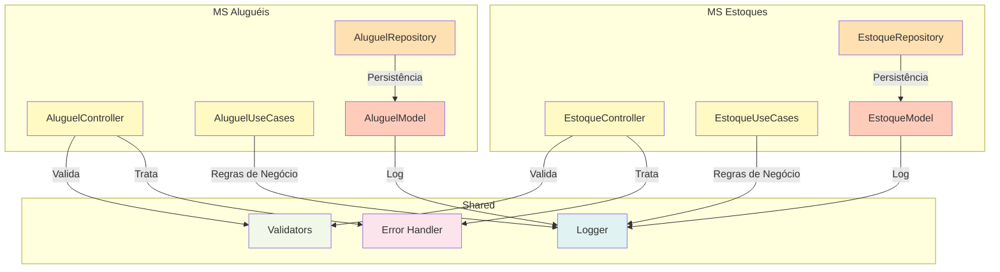

## C4 Model - Nível 3: Component

**Escopo**: Componentes internos de cada microserviço

### MS Aluguéis - Componentes

#### 1. **AluguelController**
- Camada de Interfaces
- Recebe requisições HTTP
- Valida entrada
- Chama UseCases

#### 2. **AluguelUseCases**
- Lógica de negócio
- Regras de aluguéis
- Orquestração de operações
- Retorna DTOs

#### 3. **AluguelRepository**
- Acesso a dados
- Queries SQL via Sequelize
- CRUD operations
- Transações

#### 4. **AluguelModel**
- Definição da entidade
- Schema Sequelize
- Validações do ORM
- Relacionamentos

---

### MS Estoques - Componentes

#### 1. **EstoqueController**
- Camada de Interfaces
- Recebe requisições HTTP
- Valida entrada
- Chama UseCases

#### 2. **EstoqueUseCases**
- Lógica de negócio
- Regras de estoques
- Orquestração de operações
- Retorna DTOs

#### 3. **EstoqueRepository**
- Acesso a dados
- Queries MongoDB via Mongoose
- CRUD operations
- Agregações

#### 4. **EstoqueModel**
- Definição da entidade
- Schema Mongoose
- Validações do ODM
- Relacionamentos

---

### Shared Components

#### 1. **Logger**
- Registro de operações
- Debug em desenvolvimento
- Auditoria em produção

#### 2. **Error Handler**
- Tratamento de exceções
- Formatação de erros
- HTTP status codes

#### 3. **Validators**
- Validação de entrada
- Business rules validation
- Formato de dados

### Relacionamentos entre Componentes
- Controller → UseCase → Repository → Model (fluxo de dados)
- Logger compartilhado por todos
- Error Handler centralizado
- Validators aplicados em Controllers
