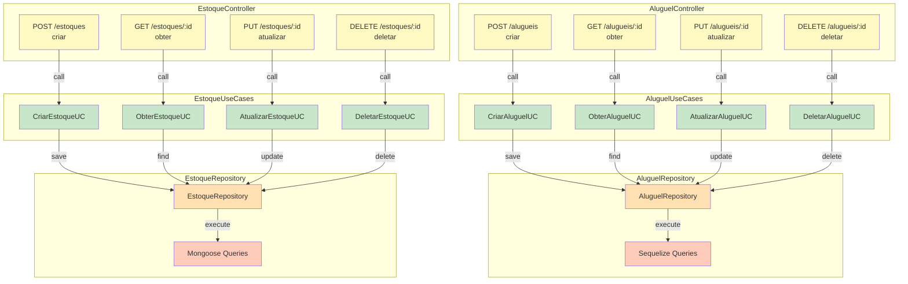

## C4 Model - Nível 4: Code

**Escopo**: Classes, métodos e fluxos de código

### Padrão CRUD - MS Aluguéis

#### **AluguelController.js**
```
POST /alugueis
├── Valida input (nome, email, datas)
├── Chama CriarAluguelUC.executar(data)
└── Retorna 201 + aluguel criado

GET /alugueis/:id
├── Valida ID
├── Chama ObterAluguelUC.executar(id)
└── Retorna 200 + aluguel

PUT /alugueis/:id
├── Valida ID e dados
├── Chama AtualizarAluguelUC.executar(id, data)
└── Retorna 200 + aluguel atualizado

DELETE /alugueis/:id
├── Valida ID
├── Chama DeletarAluguelUC.executar(id)
└── Retorna 204
```

#### **AluguelUseCases.js**
```
CriarAluguelUC.executar(data)
├── Valida datas (data_fim > data_inicio)
├── Valida valor_mensal > 0
├── Chama repository.criar(aluguel)
└── Retorna AluguelDTO

ObterAluguelUC.executar(id)
├── Chama repository.obterPorId(id)
├── Se não encontrar → throw NotFoundError
└── Retorna AluguelDTO

AtualizarAluguelUC.executar(id, data)
├── Valida dados atualizáveis
├── Chama repository.atualizar(id, data)
└── Retorna AluguelDTO atualizado

DeletarAluguelUC.executar(id)
├── Chama repository.deletar(id)
├── Se não encontrar → throw NotFoundError
└── Retorna success
```

#### **AluguelRepository.js**
```
criar(aluguel)
├── Chama Aluguel.create(aluguel)
└── Retorna instância Sequelize

obterPorId(id)
├── Chama Aluguel.findByPk(id)
└── Retorna instância ou null

atualizar(id, data)
├── Chama Aluguel.update(data, { where: { id } })
└── Retorna instância atualizada

deletar(id)
├── Chama Aluguel.destroy({ where: { id } })
└── Retorna number (linhas deletadas)
```

---

### Padrão CRUD - MS Estoques

#### **EstoqueController.js**
```
POST /estoques
├── Valida input (nome, quantidade)
├── Chama CriarEstoqueUC.executar(data)
└── Retorna 201 + estoque criado

GET /estoques/:id
├── Valida ID (MongoDB ObjectId)
├── Chama ObterEstoqueUC.executar(id)
└── Retorna 200 + estoque

PUT /estoques/:id
├── Valida ID e dados
├── Chama AtualizarEstoqueUC.executar(id, data)
└── Retorna 200 + estoque atualizado

DELETE /estoques/:id
├── Valida ID
├── Chama DeletarEstoqueUC.executar(id)
└── Retorna 204
```

#### **EstoqueUseCases.js**
```
CriarEstoqueUC.executar(data)
├── Valida quantidade >= 0
├── Chama repository.criar(estoque)
└── Retorna EstoqueDTO

ObterEstoqueUC.executar(id)
├── Chama repository.obterPorId(id)
├── Se não encontrar → throw NotFoundError
└── Retorna EstoqueDTO

AtualizarEstoqueUC.executar(id, data)
├── Valida dados atualizáveis
├── Chama repository.atualizar(id, data)
└── Retorna EstoqueDTO atualizado

DeletarEstoqueUC.executar(id)
├── Chama repository.deletar(id)
├── Se não encontrar → throw NotFoundError
└── Retorna success
```

#### **EstoqueRepository.js**
```
criar(estoque)
├── Chama Estoque.create(estoque)
└── Retorna documento Mongoose

obterPorId(id)
├── Chama Estoque.findById(id)
└── Retorna documento ou null

atualizar(id, data)
├── Chama Estoque.findByIdAndUpdate(id, data, { new: true })
└── Retorna documento atualizado

deletar(id)
├── Chama Estoque.findByIdAndDelete(id)
└── Retorna documento deletado
```

### Fluxo End-to-End

```
1. Frontend envia: POST /api/alugueis { nome, email, data_inicio, data_fim, valor_mensal }
2. BFF roteia para: POST http://ms-alugueis/api/alugueis
3. AluguelController valida e chama CriarAluguelUC
4. CriarAluguelUC valida regras de negócio
5. AluguelRepository.criar() executa INSERT no SQL Server
6. Banco retorna aluguel com ID
7. Repository retorna AluguelDTO
8. Controller retorna 201 + JSON
9. BFF retorna para Frontend
10. Frontend atualiza lista de aluguéis
```
